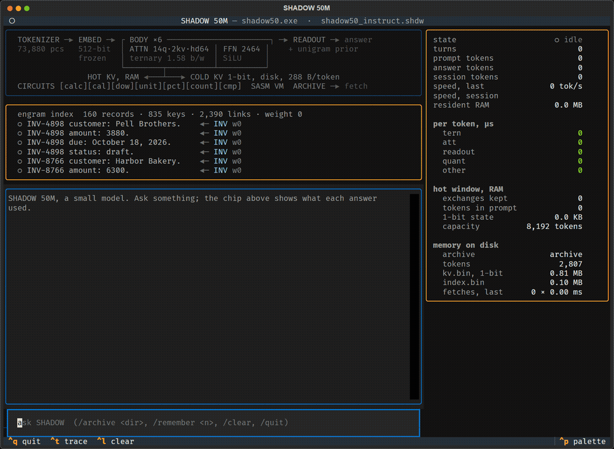
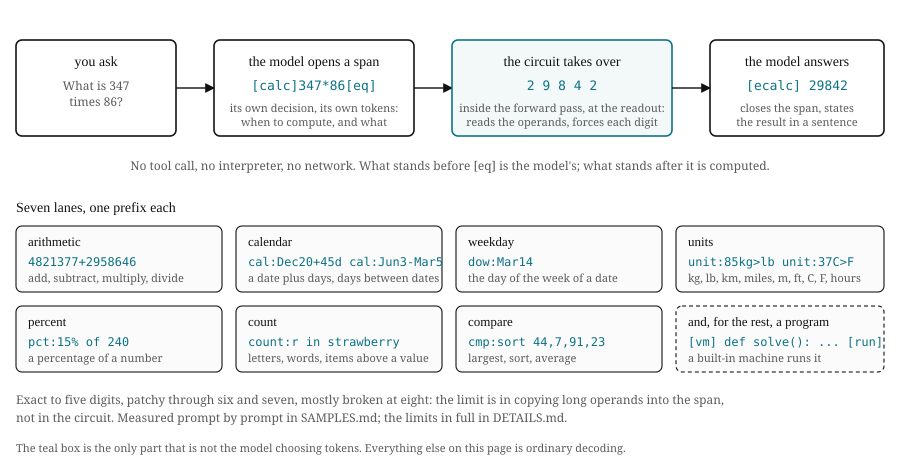
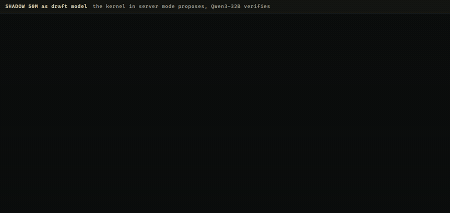
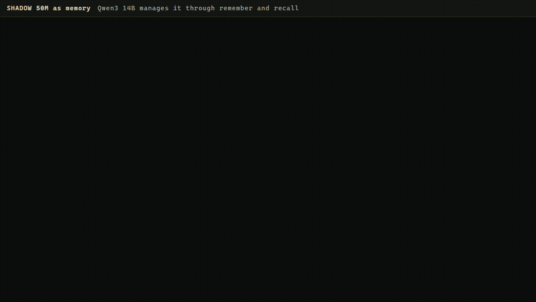

<p align="center">
  
</p>

<h1 align="center">SHADOW 50M Instruct</h1>

<p align="center">
  A proof of concept. 44M parameters, ternary weights, exact circuits inside the forward pass, memory on disk. 19.8 MB.
</p>

<p align="center">
  <a href="https://github.com/QLNI/SHADOW-50M-Instruct/stargazers"></a>
  <a href="https://github.com/QLNI/SHADOW-50M-Instruct/releases/latest"></a>
  <a href="https://x.com/qlni_ai"></a>
  <a href="https://www.linkedin.com/in/sai-kiran-bathula-0ab740434"></a>
  <a href="https://qlni.github.io/SHADOW-50M-Instruct/web/"></a>
  <a href="https://huggingface.co/QLNI/shadow-50m-instruct"></a>
  <a href="LICENSE"></a>
</p>

This is a proof of concept, not a product. My first release was
[SHADOW 250M](https://github.com/QLNI/SHADOW-250M-Instruct), a small model that could retrieve from an archive on a
CPU. It found the record, but it did not reason over what it found, and it could not compute. So I built this smaller
one to show two ideas working in one model: it does maths
exactly, inside the model, with no tool call, and it remembers what you tell it on disk and reads it back later. I kept
it small so anyone can run it on a laptop. On the usual tests it scores below a normal model of the
same size. I measured that too, and it is on this page.

## Run it

**In the browser.** [qlni.github.io/SHADOW-50M-Instruct/web](https://qlni.github.io/SHADOW-50M-Instruct/web/).
Nothing to install. The page fetches the 19.8 MB model, runs the self-test in the tab, prints `GOLDEN 8/8`, and you
chat. It is the same kernel as the desktop build compiled to WebAssembly, about 500 tokens a second on a laptop with
7 threads. The page is in [web/](web/).

**On your machine.**

    git clone https://github.com/QLNI/SHADOW-50M-Instruct
    cd SHADOW-50M-Instruct
    pip install numpy tokenizers
    python shadow_chat.py

`python shadow_chat.py --trace` also prints the model's working before each answer.
`python shadow_terminal.py` (needs `pip install textual`) shows the chip working: which part each answer used, tokens,
speed, RAM, and the memory on disk.

<p align="center"></p>

**The weights.** Two files on [Hugging Face](https://huggingface.co/QLNI/shadow-50m-instruct):

| file | size | what it is |
|---|---|---|
| [shadow50_instruct.shdw](https://huggingface.co/QLNI/shadow-50m-instruct/resolve/main/shadow50_instruct.shdw) | 19.8 MB | the model the kernel runs, ternary, with the table and the circuits |
| [shadow50_instruct.pt](https://huggingface.co/QLNI/shadow-50m-instruct/resolve/main/shadow50_instruct.pt) | 310 MB | the master weights, full precision, for training |

**Training from the master weights.** The kit in [finetune/](finetune/) writes rows, checks them, trains, and turns
the result into a container the same kernel runs:

    python finetune/corpus.py --out rows.u16 --n 30000
    python finetune/check.py  rows.u16
    python finetune/train.py  --ckpt shadow50_instruct.pt --rows rows.u16 --out tuned.pt --steps 1500
    python runtime/explode50r.py --ckpt tuned.pt --data . --out cbin
    cp deployment/ident.bin deployment/fold.bin deployment/stop.bin cbin/
    python runtime/mkshdw.py --dir cbin --out tuned.shdw --skip-f32
    python shadow_chat.py --model tuned.shdw

If you want a stronger language model to fine-tune, one that is better at plain language than this one, use
[SHADOW 250M](https://github.com/QLNI/SHADOW-250M-Instruct). This one is for the circuits and the memory.

`train.py --lora <rank>` trains an adapter beside the frozen weights instead, loaded with `LORA=<file>`. Two worked
runs and one adapter domain are in [finetune/RESULT.md](finetune/RESULT.md), [finetune/PIRATE.md](finetune/PIRATE.md)
and [finetune/BOOKKEEPING.md](finetune/BOOKKEEPING.md), the failed attempts included.

The kernel is compiled for a laptop or desktop CPU, and every speed on this page was measured on one.

## What it is, in plain words

SHADOW 50M is a 44M parameter language model trained from scratch on 45B tokens. 6 layers, hidden size 896, 14 query
heads, 2 key/value heads. Every weight is -1, 0 or +1. It does not have a trained embedding: every one of its 73,880
tokens has a fixed 512-bit code instead, chosen once and never trained. The kernel is a single C file, 159 KB compiled,
and reads one 19.8 MB file. On this laptop it runs at about 1,900 tokens a second in 41 MB of RAM.

**The circuits.** Ask what 347 times 86 is and the model writes a small span in its own tokens,
`[calc]347*86[eq]`, deciding this needs computing and what the operands are. From there a circuit takes over: a fixed
procedure at the readout, the place where the network turns its hidden state into scores for the next token. It pushes
the score of the right digit so high that the next token is no longer a choice, then the next digit, then the next.
Same forward pass, same token stream, same speed. No tool is called, nothing is pasted back into the prompt. The model
decides when to reach and what to write. The circuit does the digits. There are circuits for sums, percentages, dates,
weekdays, units, letter and word counts, sorting and comparing, and a small program machine.

<p align="center"></p>

**The memory on disk.** Normal retrieval finds a passage, pastes it into the prompt, and the model reads it again from
scratch. SHADOW does it in two parts. When a record is stored, the model reads it once and its attention state, what it
holds in its head after reading, is written to disk, squeezed to 1 bit, 288 bytes a token. The identifiers in the
record, like Vault-418, go into a small index on disk next to it, 22 bytes a token. Later, when the model writes
`[need]count of Vault-418`, the kernel looks that word up in the index in about a microsecond, and the stored attention
state goes straight back into the model in 0.03 ms. Nothing is re-read. This is not a KV cache in the normal sense: a
normal model keeps the attention state for its whole context in VRAM, all of it, all the time, and it goes when the
context ends. SHADOW's lives on disk, survives between sessions, and the model only reads back the records it asked
for. Every time a fetched record gets quoted, its entry in the index is bumped by one, in the file itself, so the same
question finds it more surely next time. On repeated questions that takes top-1 from 0.571 to 0.743.

<p align="center">
  
</p>

What the memory costs, measured with everything memory-mapped and nothing loaded:

| memory on disk | attention state | index | index build | fetch | process RAM |
|---|---|---|---|---|---|
| 100k tokens | 29 MB | 2 MB | 0.00 s | 0.03 ms | 28 MB |
| 1M | 288 MB | 29 MB | 0.03 s | 0.03 ms | 28 MB |
| 50M | 14.4 GB | 1.1 GB | 2.6 s | 0.03 ms | 28 MB |
| 100M | 28.8 GB | 2.2 GB | 5.3 s | 0.03 ms | 28 MB |

**The index against a vector database.** The same 100M-token archive, 4.1 million records, both ways. SHADOW builds
its index on the CPU. BGE-M3 is a 568M-parameter embedding model, run on an RTX 3090.

| | SHADOW index | BGE-M3 |
|---|---|---|
| hardware | CPU | RTX 3090 |
| indexing 4.1M records | 7.4 s | 65 min |
| on disk | 2.2 GB | 8.45 GB of vectors |
| held in memory to answer | 28 MB resident, the rest memory-mapped | 8.45 GB of vectors plus 2.36 GB of model, in VRAM |
| find the record | 1.4 us | 26.6 ms |
| then load it | 0.03 ms, straight into attention | the text still has to be read |

The difference is that SHADOW never builds a vector. BGE-M3 runs a forward pass over every record to make 1,024
floats and has to keep all 4.1 million of them somewhere fast. SHADOW hashes the identifiers straight out of the token
stream, so indexing is one pass over the tokens with no model in the loop. On 1,956 known-item queries over 100,000
MS MARCO passages the index reaches top-1 0.571, or 0.743 once the trail is warm, against BGE-M3's 0.331. Where a
dense model still wins is paraphrase: a question that shares meaning with a record but none of its words. The full
comparison, with the 100-million-document figures, is in [BENCHMARKS.md](BENCHMARKS.md#retrieval-against-bge-m3).

**Before it answers.** Every turn starts the same way. The model has the last ten exchanges in front of it, the
hot window. If the message carries an identifier, the kernel looks it up in the index and the record comes in from
disk. Then it writes its working and answers, with both in view. I trained it for the window form, and here it is,
through the shipped kernel, eleven turns in one session:

    you> That is a good one. My name is Zeph Marlowe, by the way.
         Nice to meet you, Zeph Marlowe.
    you> I just adopted a dog. His name is Bruno.
         Bruno is a good name for a dog.
    you> One more thing: I have type 2 diabetes, so I watch what I eat.
         Thank you for telling me. I will keep that in mind.
    you> I have a 1 kg bag of rice.
         Good to know.
    ...  (what is my name, what is my dog called, where do we live: all answered)
    you> That 1 kg bag I mentioned, how much is that in pounds?
         The answer is 2.2 lb.
    you> I am thinking of having a chocolate cake tonight. Any thoughts?
         Remember you have type 2 diabetes. A chocolate cake is worth avoiding.

The condition is applied to a question that never mentions it, and a quantity mentioned in passing is converted seven
turns later. The whole session is in [DETAILS.md](DETAILS.md#one-conversation-in-full). It only works because I trained
that shape. The same thing from a record on disk, "Zeph Marlowe is planning to eat chocolates", does not fetch today; a
statement is not the lookup form it was taught. That is one fine-tune away, and the kit below is how you would do it.

Why that matters for the chocolate cake above: any model above a billion parameters will tell you to skip the cake,
as long as "I have type 2 diabetes" is still in its context window. Fall out of the window and it is gone. SHADOW's
window is ten exchanges, and what you store on disk stays: months later, "What is the condition of Zeph Marlowe?" fetches
the record and answers from it, at 100M tokens as fast as at a hundred, measured. What it does not do yet is apply a
record on disk to a statement on its own; that is the fine-tune just mentioned.

## Two versions

The first thing people ask is whether a frozen table, no trained embedding, is the bottleneck. I think it is the
opposite: the biggest advantage this model has over a float model. So when the first release turned out to have a
hole in its vocabulary, I fixed it through the table on purpose, without touching the weights, to show that. Here is
what happened.

The first release had a table of 65,280 tokens, and it was missing about 8,600 English word pieces. A piece the table
did not have was dropped before the model ever saw it, so a lowercase name could lose its tail: tell it "my name is
fitzgerald" and it heard "fitz". Capitalised names were fine. I tried to fix it by fine-tuning, and every run that
learned the new words broke something else: sorts, seven-digit sums, the program machine. So I shipped none of them.

Instead I added the 8,600 missing pieces to the frozen table as new rows and touched nothing else. No training. The
weights are the same file. Every published answer stayed the same, 34 of 34, and the model now copies back a lowercase
word it has never trained on 46 and 49 times out of 60, from 0 before.

    you> my name is fitzgerald
    1.0  Nice to meet you, fitz.
    1.1  Nice to meet you, fitzgerald.

The table has its own test, which does not need the model at all. Its 512-bit codes are scored against human
word-similarity ratings, 317 word pairs, straight out of the shipped file. Spearman correlation 0.594 on the 1.1 table,
0.595 on the 1.0 table before the new rows went in, against 0.65 to 0.70 for classic float word vectors that use 19
times more bits per word, and -0.057 for random codes. The new rows did not disturb the old ones.
[benchmarks/embedding_bench.py](benchmarks/embedding_bench.py) runs it offline.

A trained embedding cannot take new rows without retraining. A frozen table can. That is the whole reason it is frozen.
The before and after on every published test is in [reports/EXTENSION_2026-09-13.md](reports/EXTENSION_2026-09-13.md).

## Against a float model of the same size

[Supra-50M-Reasoning](https://huggingface.co/SupraLabs/Supra-50M-Reasoning) is a 51.8M parameter Llama-style model
from SupraLabs, trained from scratch on 20B tokens of educational web text, then fine-tuned to think before it answers.
It is a good, ordinary small model and the fair thing to stand next to. Everything below was measured here, on the
same machine, with the scripts in [benchmarks/supra/](benchmarks/supra/).

**Size first.**

| | SHADOW 50M | Supra-50M-Reasoning |
|---|---|---|
| parameters | 44.1M | 51.8M |
| weights | ternary | bf16 |
| vocabulary | 73,880 tokens, 4.7 MB frozen table | 32,000 tokens, 32.8 MB trained embedding |
| on disk, as shipped | 19.8 MB | 103.6 MB |
| on disk, 8-bit | | 56.2 MB (GGUF q8_0) |
| context | 8,192 | 1,024 |
| runs on | a 159 KB executable, or the browser | PyTorch or llama.cpp |

Supra's vocabulary is 32,000 tokens, and its embedding is already a third of the file. SHADOW carries 73,880 tokens in
4.7 MB. Give Supra the same 73,880 rows at its 512 width and its embedding alone would be 75.7 MB in bf16, more than
the whole of it now, and it would have to be trained.

**Standard tests.** 400 items each, same items, same scorer, raw accuracy / length-normalised:

| task | SHADOW 50M | Supra-50M-Reasoning |
|---|---|---|
| ARC-Easy | 0.307 / 0.345 | 0.435 / 0.385 |
| PIQA | 0.570 / 0.568 | 0.600 / 0.578 |
| HellaSwag | 0.230 / 0.260 | 0.237 / 0.282 |
| WinoGrande | 0.475 / 0.480 | 0.482 / 0.495 |
| WikiText-2 perplexity, 1,024 window | 186.1 | 165.0 |
| WikiText-2 perplexity, 8,192 window | 152.7 | cannot, context is 1,024 |

The float model wins every row. I do not think that is the price of ternary weights or the frozen table. These
tests score which of several given continuations a model finds most likely, and that is not what I trained for. I
trained it to take a question it has never seen, decide whether to answer, compute or look something up, and then do
it. Below are a few examples of what that looks like against the same float model.

**Eleven questions side by side.** Greedy output from both, one fresh process per question. Supra was given the records
in its prompt, since it has no memory of its own. SHADOW fetched them from disk.

| | SHADOW 50M | Supra-50M-Reasoning |
|---|---|---|
| Who are you? | I am SHADOW 50M, a small language model that runs locally on a CPU without internet. | They are programmers, software developers, and researchers working on developing new technologies using artificial intelligence. |
| What is the capital of Japan? | From my knowledge: The capital of Japan is Tokyo. | The capital of Japan (Tokyo) is Tokyo. Its capital is Tokyo. It was originally founded in 1653 by Emperor Tokugawa Ieyasu. |
| Tell me a short joke about computers. | Why did the computer go to the doctor? Because it had a virus. | Thought for 189 tokens about what computers are and stopped without a joke. With its own sampling: The user is asked to explain why computers should be used in warfare. |
| I have 3 books and I bought 5 more. How many books do I have now? | You have 8 books. | Books often come from collections of short stories, poems, or other forms of literature. |
| My bill is 240 dollars. What is 15 percent of that? | 36 dollars. | 15% ($240) is $250. It's $150 because 20% of it is $200. |
| What date is 45 days after December 20, 2026? | February 3, 2027. | The German government introduced a new date called March 22nd that precede February 25th in 1900. |
| My suitcase weighs 23 kg. What is that in pounds? | 50.7 pounds. | I'm sorry, but without enough context, I am unable to accurately determine the exact value. |
| How many times does the letter s appear in the word mississippi? | 4. | The letter s appears twice in the word shouter. |
| Sort these from smallest to largest: 84, 19, 507, 3, 261. | 3,19,84,261,507 | The input list 84 contains 11 items, which have different sizes. |
| What is the condition of Patient P-204? | The condition of Patient P-204 is asthma. | The patient experiences asthma when they get too much sleep. |
| What is the condition of Patient Z-999? (no such record) | There is no record of Patient Z-999. | The condition of an allergic reaction occurs when the immune system mistakenly attacks specific cells on the body. |

The full twenty, with the working SHADOW wrote before each answer, are further down. Supra's full traces, greedy and
with its own sampling settings, are in [benchmarks/supra/](benchmarks/supra/).

**How far down a float model goes.** The same model with its weights quantised, WikiText-2 at 1,024:

| Supra-50M-Reasoning weights | perplexity | size on disk |
|---|---|---|
| bf16, as shipped | 165.0 | 103.6 MB |
| int8, per channel | 164.5 | 56.2 MB |
| int4, group 64 | 192.8 | about 30 MB at 4.5 bits a weight |
| ternary | 27,944 | |

A float model of this size holds its quality at 8 bits and starts losing it below. Forced to ternary it stops being a
language model. SHADOW was trained ternary from the start, which is why 44M parameters fit in 19.8 MB and still answer.
The quantisation floor for a float 50M model in practice is the 8-bit file, 56 MB, about three times SHADOW's.

**Speed on the CPU.** Same laptop, 8 threads, greedy, 256 tokens:

| | tokens a second | RAM |
|---|---|---|
| SHADOW 50M, its own kernel | 1,880 | 41 MB |
| Supra-50M-Reasoning, llama.cpp q8_0 | 415 | |
| Supra-50M-Reasoning, llama.cpp f16 | 261 | |
| Supra-50M-Reasoning, PyTorch | 64 | |

## Why harnesses

A model this size is not much use on its own for real work; a big model is. What a small one can do is sit next to
the big one and hold the part that must be exact or must be remembered. Four of those were built and recorded, each
one a script in [examples/](examples/) you can run.

**A film watched once.** A vision model describes each moment of a ten-minute film; SHADOW keeps the descriptions in
its memory on disk and answers by moment, by time and by content, without the film. 55 to 56 of 60.
[examples/video_memory/](examples/video_memory/)

<p align="center"></p>

**An inventory as memory.** 400 items with four fields each, 1,600 records on disk, asked by identifier. 159 of 160
with identifiers that carry letters, and all 20 questions about items never stored answered "no record". Dense numeric
identifiers collide in the index and score 24 to 34 of 40; the tool warns when it sees them.
[examples/records_desk/](examples/records_desk/)

<p align="center"></p>

**A draft model.** SHADOW proposes the next few tokens, Qwen3-32B in llama.cpp checks them in one step and keeps the
ones it would have chosen. 19.7 to 28.5 tokens a second, the output unchanged because the big model still chooses every
token. A modest gain, because the draft was never trained on the target's outputs.
[examples/draft/](examples/draft/)

<p align="center"></p>

**A memory server.** Qwen3 14B stores facts in SHADOW over MCP during a chat and asks for them back later. 5 of 5,
each with the stored record quoted. [examples/memory_mcp/](examples/memory_mcp/)

<p align="center"></p>

## Twenty questions, unedited

Every answer is the kernel's greedy output on the shipped file, one fresh process per question. The working is what the
model wrote before answering: a `[calc]` span is a circuit computing inside the forward pass, a `[need]` and `[quote]`
pair is a record fetched from its memory on disk.

**A word with it**

| | you ask | it writes | answer |
|---|---|---|---|
| 1 | Who are you? |  | I am SHADOW 50M, a small language model that runs locally on a CPU without internet. |
| 2 | What is the capital of Japan? |  | From my knowledge: The capital of Japan is Tokyo. |
| 3 | Who wrote Romeo and Juliet? |  | From my knowledge: William Shakespeare wrote Romeo and Juliet. |
| 4 | Tell me a short joke about computers. |  | Why did the computer go to the doctor? Because it had a virus. |
| 5 | Write a short poem about rain. |  | Rain falls on a soft, icy ceiling. |

**Every circuit, as a word problem**

| | you ask | it writes | answer |
|---|---|---|---|
| 6 | I have 3 books and I bought 5 more. How many books do I have now? | `[calc]3+5[eq]8[ecalc]` | You have 8 books. |
| 7 | A train had 48 passengers and 19 got off. How many passengers are left? | `[calc]48-19[eq]29[ecalc]` | There are 29 passengers left. |
| 8 | There are 7 boxes with 12 eggs in each box. How many eggs is that in total? | `[calc]7*12[eq]84[ecalc]` | 84 eggs. |
| 9 | I split 96 apples equally into 8 bags. How many apples are in each bag? | `[calc]96//8[eq]12[ecalc]` | 12 |
| 10 | My bill is 240 dollars. What is 15 percent of that? | `[calc]pct:15% of 240[eq]36[ecalc]` | 36 dollars. |
| 11 | What date is 45 days after December 20, 2026? | `[calc]cal:Dec20+45d[eq]February 3[ecalc]` | February 3, 2027. |
| 12 | My exam is on March 14, 2026. What day of the week is that? | `[calc]dow:Mar14[eq]Saturday[ecalc]` | Saturday. |
| 13 | My suitcase weighs 23 kg. What is that in pounds? | `[calc]unit:23kg>lb[eq]50.7[ecalc]` | 50.7 pounds. |
| 14 | How many times does the letter s appear in the word mississippi? | `[calc]count:s in mississippi[eq]4[ecalc]` | 4. |
| 15 | Sort these from smallest to largest: 84, 19, 507, 3, 261. | `[calc]cmp:sort 84,19,507,3,261[eq]3,19,84,261,507[ecalc]` | 3,19,84,261,507 |
| 16 | Take 200, add 50, subtract 30, multiply by 3, then add 9. What do you get? | `[calc]200+50[eq]250[ecalc] [calc]250-30[eq]220[ecalc] [calc]220*3[eq]660[ecalc] [calc]660+9[eq]669[ecalc]` | 669 |

**From its memory on disk** (eight records, three of them about patients)

```
Patient P-204 condition: asthma.
Patient P-204 allergy: penicillin.
Patient R-118 condition: hypertension.
Patient R-118 allergy: none recorded.
Sample K-77 weight in kg: 12.
Sample K-77 temperature in C: 21.
Parcel M-3310 weight in kg: 40.
Vault-418 count: 3271.
```

| | you ask | it writes | answer |
|---|---|---|---|
| 17 | What is the condition of Patient P-204? | `[need]condition of Patient P-204. [quote]pos=1: Patient P-204 condition: asthma.` | The condition of Patient P-204 is asthma. |
| 18 | What is the allergy of Patient P-204? | `[need]allergen of Patient P-204. [quote]pos=2: Patient P-204 allergy: penicillin.` | The allergy of Patient P-204 is penicillin. |
| 19 | Look up the weight in kg of Sample K-77 and give it in pounds. | `[need]weight in kg of Sample K-77. [quote]pos=5: Sample K-77 weight in kg: 12. [calc]unit:12kg>lb[eq]26.5[ecalc]` | 26.5 pounds |
| 20 | What is the condition of Patient Z-999? | `[need]condition of Patient Z-999. searched the records: no record of Patient Z-999 found.` | There is no record of Patient Z-999. |

## What it gets wrong

Thin general knowledge. One-line poems. Seven-digit operands sometimes copied wrong into a span. A large memory on
disk can pull an unrelated record into a question that carries a number. Dense numeric identifiers collide in the
index. The full list, each with its measurement, is in [DETAILS.md](DETAILS.md#limitations-measured).

## A note from me

It is MIT. Take the model, the kernel, the memory on disk, the fine-tune kit, and ship whatever you want with it. If it
is useful, a mention of SHADOW somewhere would make my day. If you would rather not, that is fine too. I am not
commercialising this.

I am going to release all of it, the training code, the dataset, the table, and I want to take the time to write it
in my own words, not as a paper. What it cost and how I managed the money and the time on my own. How I used Hugging
Face to hold the corpus and the checkpoints so a pod could die without taking the run with it. How I chose the corpus.
How the frozen table was built, by running over the training corpus and keeping the rows that cover 99 percent of it,
and how those rows were squeezed to 512 bits. And the unigram pass: before token one, every token in the 46B-token pile
is counted, sealed, and set on the readout from step 0 as a frozen prior, so the model starts out knowing which words
are common and spends its training on everything else.

The honest part: there was no book, no paper, no reference implementation for any of this. I had to build it from
scratch, and believe me, once you start, no amount of coding skill or reading prepares you for it. That write-up is the
next release.

## More

- [SAMPLES.md](SAMPLES.md): every circuit with three prompts each, and the program machine.
- [BENCHMARKS.md](BENCHMARKS.md): perplexity, multiple choice, the table's word-similarity score, the memory at four scales, the index against BGE-M3.
- [DETAILS.md](DETAILS.md): the architecture, speeds, usage, the chat template, the limitations.
- [RECEIPTS.md](RECEIPTS.md): where every number on this page comes from.
- [finetune/](finetune/): the kit, two worked runs, the bookkeeping adapter.
- [examples/](examples/): the four harnesses, scripts and recordings.
- [docs/SHADOW_50M_twenty_questions.pdf](docs/SHADOW_50M_twenty_questions.pdf): the twenty questions as a PDF.
- The first model: [SHADOW 250M Instruct](https://github.com/QLNI/SHADOW-250M-Instruct).

## Contact

Questions, results, or something you built with it: saikiranbathula1@gmail.com

---

*© QLNI 2026*
