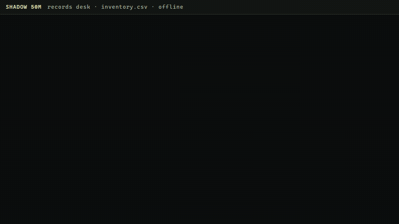

# Records desk

An inventory, an order log, a list of anything with identifiers: the file becomes SHADOW's memory on disk, and you ask it
by identifier. The answer comes with the record it used, quoted with its position, and a key that is not there is reported
as not there. Nothing leaves the machine; the kernel runs on the CPU at about 2,000 tokens a second in 40 MB.

    python examples/records_desk/records_desk.py build inventory.csv out/
    python examples/records_desk/records_desk.py ask   out/ "What is the quantity of KQ-417?"
    python examples/records_desk/records_desk.py chat  out/

A CSV becomes one record per column: `Record KQ-417 quantity: 1591.` The first column is the identifier. A plain text file
is kept line by line.

## Measured

400 items, four fields each, 1,600 records on disk; 40 questions per field, every one a fresh kernel process reading the
archive from disk. The identifier shape decides the result:

| identifiers | item | quantity (up to 4 digits) | bin | supplier | absent key reported absent |
|---|---|---|---|---|---|
| `KQ-417` (letters and three digits) | 40/40 | 40/40 | 39/40 | 40/40 | 20/20 |
| `SKU-1318` (a dense run of four-digit numbers) | 24/40 | 24/40 | 34/40 | 29/40 | 20/20 |

Sequential numeric identifiers collide in the index (1318 against 1183 share their pieces) and the model then answers
with a neighbour's value. Identifiers that carry letters do not collide. `build` warns when a file's identifiers look
like a dense numeric run. Also measured: one record per row with all four fields in the line scores far worse (3 to 14
of 40), so the tool always writes one record per column; and the attribute word `name` is confused with other
attributes (4 of 40), so call that column `item` or `description`.

A 300-line order log kept line by line, asked "Where was order 4110 sent?": 30 of 40. The misses are lines whose wording
does not match the question ("delayed at", "returned from"); a question that shares no words with the line misses.

Fetch from disk: under 0.1 ms per question after the first; 42 MB resident with the 1,600-record archive.

## Limits

Everything in [DETAILS.md](../../DETAILS.md#limitations-measured) applies. In particular: attribute names must not
contain one another; a bare attribute can land on the wrong record; ask with the full attribute word the record uses.
