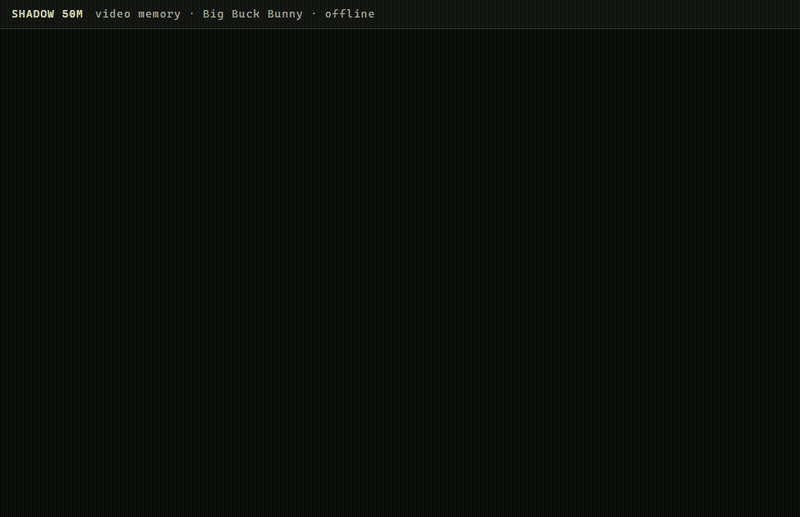

# Video memory

A vision model watches a video once and writes one line per moment. SHADOW keeps those lines as its memory on disk and
answers about any moment afterwards: by its number, by its time, or by what was in it. The answer comes with the record
it read, quoted with its position; a moment that was never seen is reported as not there. The whole thing runs on a
laptop, offline, in 42 MB.

    python examples/video_memory/video_memory.py build film.mp4 out/        # frames -> captions -> records -> archive
    python examples/video_memory/video_memory.py ask   out/ "What was seen at 04:10?"
    python examples/video_memory/video_memory.py ask   out/ "When does a butterfly appear?"
    python examples/video_memory/video_memory.py chat  out/

Needs ffmpeg and Ollama with a vision model (default `gemma3:4b`). `build` samples one frame every two seconds, asks the
vision model for a sentence, the objects and the people in each, and keeps one record per moment:

    Moment M-0039 scene: A chubby white rabbit reaches for a purple butterfly.

The record holds the caption's first clause, at most ten words. The model reads a record back by copying it, and the copy
frays past that length. The objects and people the vision model listed stay in `captions.jsonl`, where they feed a word
index; they are not archive records, because a second record under the same key steals the fetch (measured, below).

## How a question is answered

- "What is the scene at moment M-0039?": the model finds the record by the identifier and reads it back.
- "What was seen at 04:10?": the harness maps the time to the nearest moment, the model reads that record.
- "When does a butterfly appear?": no identifier, so the archive's index has nothing to key on. The harness looks the
  question's words up in the captions, picks the moment they point at, and the model reads that record back with its time.
  The word index finds; the model remembers. Said plainly because it is the design, not a claim about the model.

## Measured

Big Buck Bunny (Blender Foundation, CC BY 3.0), 9 minutes 54 seconds, 298 frames, one every two seconds. Captions from
Gemma 3 4B through Ollama on a laptop GPU, 3.5 seconds a frame. Sixty questions per shape, every one a fresh kernel process
with the archive on disk; an answer is right when it carries at least two thirds of the stored record's words.

| question | right |
|---|---|
| by moment number | 55/60 |
| by time | 55/60 |
| by content, through the word index | 56/60 |
| a moment that does not exist | reported as no record |

The misses are answers cut short on a long word ("a large fluff" for "a large fluffy bunny"), never a wrong moment.
Two designs that were measured and rejected: three records per moment (scene, objects, people) put the fetch on the wrong
record for a third of the questions (41 of 60), and the model asked "what objects are at moment M-0042" answered from the
wrong record 42 times in 60. One short record per moment is what works.

| | |
|---|---|
| archive for the film | 298 records, 6,425 tokens, 1.85 MB of 1-bit memory on disk |
| fetch from disk | under 0.1 ms per question after the first |
| resident memory while answering | 42 MB |
| an hour of video at this rate | about 39,000 tokens, about 11 MB of memory |
| the 100M-token archive measured in the README | about 2,500 hours of video, same 0.03 ms fetch, same 28 MB resident |

## Limits

What the vision model did not write cannot be recalled: the memory is the captions, and their quality is the vision
model's. A question whose words appear in no caption has nothing to point at. Everything in
[DETAILS.md](../../DETAILS.md#limitations-measured) applies.
